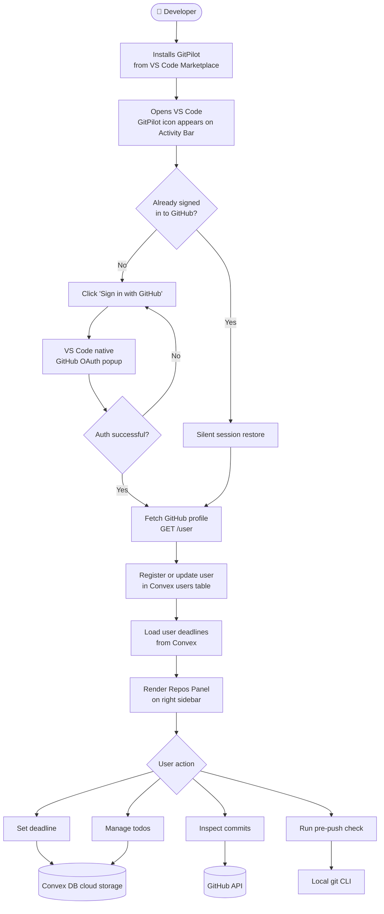
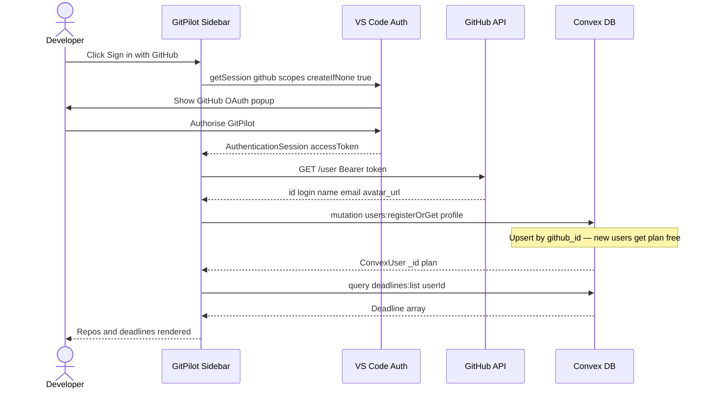
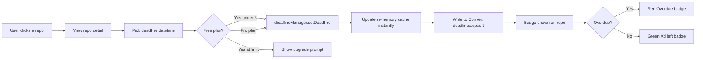
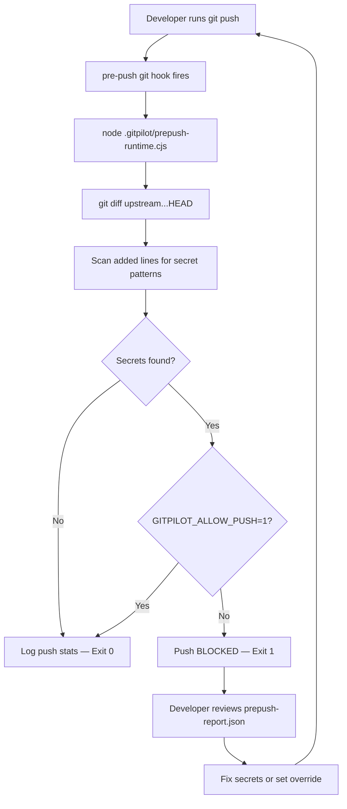
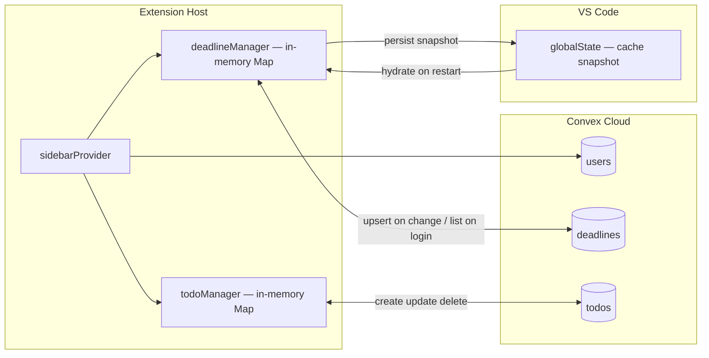
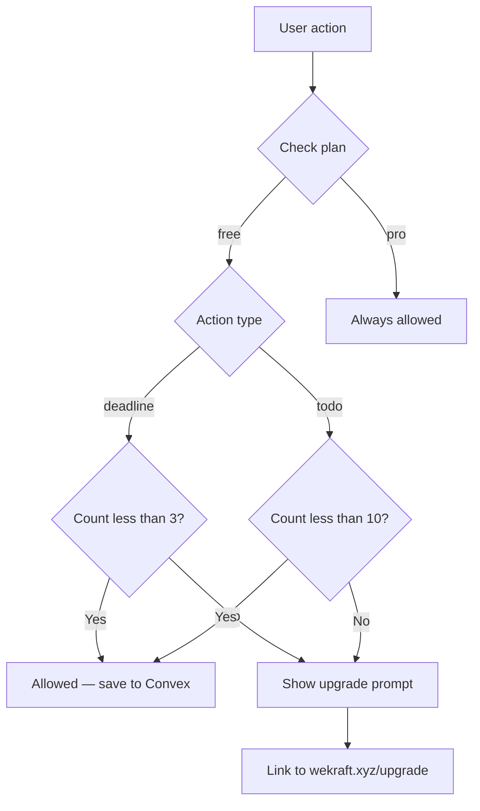

# GitPilot — User Flow

This document traces every path a user takes through the GitPilot VS Code extension, from first install to daily developer workflow.

---

## 1. High-Level Journey



---

## 2. Authentication Flow



---

## 3. Deadline Tracking Flow



---

## 4. Todo Workflow

```mermaid
stateDiagram-v2
    [*]         --> open        : createTodo
    open        --> in-progress : Check partial
    open        --> done        : Check complete
    in-progress --> done        : Check complete
    done        --> open        : Uncheck
    open        --> [*]         : Delete
    in-progress --> [*]         : Delete
    done        --> [*]         : Delete
```

---

## 5. Pre-Push Security Check Flow



---

## 6. Data Persistence Model



---

## 7. Plan Limits Enforcement


